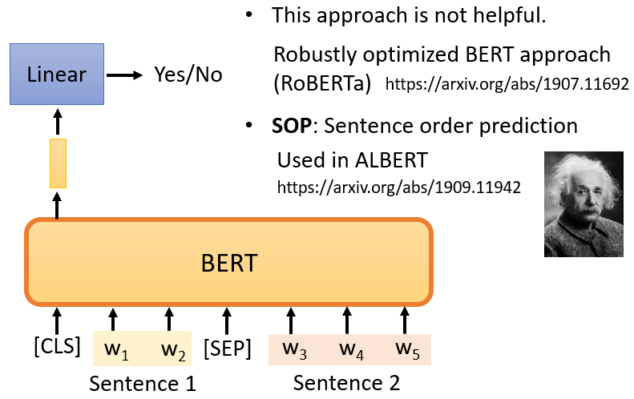

# 基于Bert的文本情感分析

## 一、网上寻找数据集，我们找到了两个情感分析数据集，分别是：

- [**ChnSentiCorp**：情感分析](https://github.com/pengming617/bert_classification)（7000 多条酒店评论数据，5000 多条正向评论，2000 多条负向评论）
- [weibo_senti_100k](https://pan.baidu.com/s/1DoQbki3YwqkuwQUOj64R_g)（10 万多条，带情感标注 新浪微博，正负向评论约各 5 万条）

## 二.预期的实验计划

1. 重新清洗两个数据集，并修改为SST-2数据集的格式，并进行合并，扩充数据集。
2. 利用Bert+CRF的模型直接进行Fine-Turing，将实验结果作为后续探究的实验基准线。
3. 尝试使用Bert+GRU+CRF的结构在相同的数据上进行Fine-turing，与第二步做出的实验进行对比，观察GRU是否对结果有提升，并分析。
4. 尝试使用Bert+BiLSTM+CRF的结构在相同的数据上进行Fine-turing，与第二步做出的实验进行对比，观察BiLSTM是否对结果有提升，并分析。与第三步的实验结对照，观察GRU和BILSTM的效果哪个好，并分析。
5. 尝试使用Bert+CNN+DNN+CRF的结构在相同的数据上进行Fine-turing，观察效果并分析

## 三.代码环境配置

1. 安装Anaconda

   推荐从国内镜像站下载，速度快且方便，以[北京外国语大学镜像站](https://mirrors.bfsu.edu.cn/)为例

   - https://mirrors.bfsu.edu.cn/anaconda/archive/ 在这个链接下挑选Anaconda版本

   - 下载完毕进行安装

     由于各个系统安装方法有细微差别，总体不再赘述。在安装时候切记允许软件将环境变量写入。

   - 更换Anaconda镜像下载源

     由于Anaconda默认下载再国外，因此需要切换到国内镜像。方法链接：https://mirrors.bfsu.edu.cn/help/anaconda/

2. 安装环境

   Python==3.6

   Pytorch==1.7.1(CPU,GPU版本均可)

   transformers==3.0.1

3. pip换源

   方法：https://mirrors.bfsu.edu.cn/help/pypi/

## 四.网络介绍

### **Self-supervised Learning**

- 每个人都应该熟悉监督学习，当我们做监督学习时，我们只有一个模型，这个模型的输入是x，输出是y。

  假设你今天想做情感分析，你就是让机器阅读一篇文章，而机器需要对这篇文章进行分类，是正面的还是负面的，你必须先找到大量的文章，你需要对所有的文章进行label。我们需要**有标签和文章数据来训练监督模型**

- "Self-supervised "是用另一种方式来监督，没有标签。假设我们只有一堆没有label的文章，但我们试图找到一种方法把它**分成两部分**。

  我们让其中一部分作为模型的输入数据，另一部分作为标签。

  假设你有没有label的数据，例如，一篇文章叫x，我们把x分成两部分，**一部分叫x'，另一部分叫x''**，我知道现在的说明很抽象。稍后，当我们真正谈论BERT时，你可以更好地理解Self-supervised的含义，以及如何在明明没有办法进行监督训练的情况下，最终还是找到了自己进行监督训练的方法。

  我们把x分成两部分，x'和x''，然后把**x'输入模型，让它输出y**。如果我们在模型训练中使用标签，我们称之为监督学习。由于在Self-supervised学习中不使用标签，我们可以说，Self-supervised学习也是一种无监督的学习方法。但之所以叫Self-supervised Learning，是为了让定义更清晰。

- "Self-supervised Learning "这个词，当初Yann LeCun说过，其实并不是一个老词。根据2019年4月在Facebook上的一个帖子，他说，我现在说的这个方法，他叫Self-supervised Learning。为什么不叫无监督学习呢？因为无监督学习是一个比较大的家族，里面有很多不同的方法，为了让定义更清晰，我们叫它 "自监督"，比如我们之前提到的cycle gan，也是无监督学习的一个案例，我们也不使用标注的配对数据，但是，它和Self-supervised Learning还是有点区别。在无监督学习的范畴内，有很多方法，Self-supervised Learning就是其中之一。

#### Masking Input

Self-supervised Learning是什么意思呢，我们直接拿BERT模型来说。

首先，**BERT是一个transformer的Encoder**，我们已经讲过transformer了，我们也花了很多时间来介绍Encoder和Decoder，transformer中的Encoder它实际上是BERT的架构，它和transformer的Encoder完全一样，里面有很多Self-Attention和Residual connection，还有Normalization等等，那么，这就是BERT。

如果你已经忘记了Encoder里有哪些部件，你需要记住的关键点是，**BERT可以输入一行向量，然后输出另一行向量，输出的长度与输入的长度相同**。 

BERT一般用于自然语言处理，用于文本场景，所以一般来说，它的输入是一串文本，也是一串数据。

当我们真正谈论Self-Attention的时候，我们也说**不仅文本是一种序列，而且语音也可以看作是一种序列，甚至图像也可以看作是一堆向量**。BERT同样的想法是，不仅用于NLP，或者用于文本，它也可以用于语音和视频。

接下来我们需要做的是，随机**盖住**一些输入的文字，**被mask的部分是随机决定的**，例如，我们输入100个token，什么是token？在中文文本中，我们通常把一个汉字看作是一个token，当我们输入一个句子时，其中的一些词会被随机mask。

mask的具体实现有**两种方法**。

- 第一种方法是，用一个**特殊的符号替换句子中的一个词**，我们用 "MASK "标记来表示这个特殊符号，你可以把它看作一个新字，这个字完全是一个新词，它不在你的字典里，这意味着mask了原文。
- 另外一种方法，**随机**把某一个字**换成另一个字**。中文的 "湾"字被放在这里，然后你可以选择另一个中文字来替换它，它可以变成 "一 "字，变成 "天 "字，变成 "大 "字，或者变成 "小 "字，我们只是用随机选择的某个字来替换它

所以有两种方法来做mask，一种是添加一个特殊的标记 "MASK"，另一种是用一个字来替换某个字。

两种方法都可以使用。**使用哪种方法也是随机决定的**。因此，当BERT进行训练时，向BERT输入一个句子，**先随机决定哪一部分的汉字将被mask**。

mask后，一样是输入一个序列，我们把BERT的相应输出看作是另一个序列，接下来，我们在输入序列中寻找mask部分的相应输出，然后，这个向量将通过一个==Linear transform==。

所谓的Linear transform是指，输入向量将与一个**矩阵相乘**，然后做softmax，输出一个分布。

这与我们在Seq2Seq模型中提到的使用transformer进行翻译时的输出分布相同。输出是一个很长的向量，包含我们想要处理的每个汉字，每一个字都对应到一个分数。

在训练过程中。我们知道被mask的字符是什么，而BERT不知道，我们可以用一个one-hot vector来表示这个字符，并使输出和one-hot vector之间的交叉熵损失最小。

或者说得简单一点，我们实际上是在解决一个**分类问题**。现在，BERT要做的是，**预测什么被盖住**。被掩盖的字符，属于 "湾"类。

在训练中，我们**在BERT之后添加一个线性模型**，并将它们**一起训练**。所以，BERT里面是一个transformer的Encoder，它有一堆参数。这两个需要共同训练，并试图**预测被覆盖的字符是什么**，这叫做mask。

#### Next Sentence Prediction 

事实上，当我们训练BERT时，除了mask之外，我们还会使用另一种方法，这种额外的方法叫做==Next Sentence Prediction== 。

它的意思是，我们从数据库中拿出两个句子，这是我们通过在互联网上抓取和搜索文件得到的大量句子集合，我们在这**两个句子之间**添加一个**特殊标记**。这样，BERT就可以知道，这两个句子是不同的句子，因为这两个句子之间有一个分隔符。

我们还将在句子的**开头**添加一个**特殊标记**，这里我们用CLS来表示这个特殊标记。

现在，我们有一个很长的序列，包括**两个句子**，由SEP标记和前面的CLS标记分开。如果我们把它传给BERT，它应该输出一个序列，因为输入也是一个序列，这毕竟是Encoder的目的。

我们将**只看CLS的输出**，我们将把它乘以一个Linear transform。

现在它必须做一个**二分类问题**，有两个可能的输出：是或不是。这个方法被称为Next Sentence Prediction ，所以我们需要预测，第二句是否是第一句的后续句。

然而，后来的研究发现，对于BERT要做的任务来说，**Next Sentence Prediction 并没有真正的帮助**。例如，有一篇论文叫 "Robustly Optimized BERT Approach"，简称RoBERTa。在这篇论文中，它明确指出，实施Next Sentence Prediction ，几乎没有任何帮助。然后，这个概念不知不觉地成为主流。

在这之后，另一篇论文说下一句话预测没有用，所以在它之后的许多论文也开始说它没有用。例如，SCAN-BERT和XLNet都说Next Sentence Prediction 方法是无用的。它可能是无用的原因之一是，**Next Sentence Prediction 太简单了**，是一项容易的任务。

这个任务的典型方法是，首先随机选择一个句子，然后从数据库中或随机选择要与前一个句子相连的句子。通常，当我们随机选择一个句子时，它看起来与前一个句子有很大不同。对于BERT来说，预测两个句子是否相连并不是太难。因此，在训练BERT完成Next Sentence Prediction 的任务时，**没有学到什么太有用的东西**。

还有一种类似于Next Sentence Prediction 的方法，它在纸面上看起来更有用，它被称为==Sentence order prediction==，简称SOP。

这个方法的主要思想是，我们最初挑选的两个句子可能是相连的。可能有两种可能性：要么句子1在句子2后面相连，要么句子2在句子1后面相连。有两种可能性，我们问BERT是哪一种。

也许因为这个任务更难，它似乎更有效。它被用在一个叫ALBERT的模型中，这是BERT的高级版本。由于ALBERT这个名字与爱因斯坦相似，我在幻灯片中放了一张爱因斯坦的图片。

当我们训练时，我们要求BERT学习两个任务。

- 一个是掩盖一些字符，具体来说是汉字，然后要求它填补缺失的字符。

- 另一个任务表明它能够预测两个句子是否有顺序关系。

所以总的来说，BERT它学会了如何填空。BERT的神奇之处在于，在你训练了一个填空的模型之后，它还可以**用于其他任务**。这些任务**不一定与填空有关**，也可能是完全不同的任务，但BERT仍然可以用于这些任务，这些任务是BERT实际使用的任务，它们被称为==Downstream Tasks==(下游任务)，以后我们将谈论一些Downstream Tasks 的例子。

所谓的 "Downstream Tasks  "是指，你真正关心的任务。但是，当我们想让BERT学习做这些任务时，我们仍然**需要一些标记的信息**。

总之，BERT只是学习填空，但是，以后可以用来做各种你感兴趣的Downstream Tasks 。它就像胚胎中的干细胞,它有各种无限的潜力，虽然它还没有使用它的力量,它只能填空,但以后它有能力解决各种任务。我们只需要给它一点数据来激发它，然后它就能做到。

BERT分化成各种任务的功能细胞，被称为==Fine-tune==(微调)。所以，我们经常听到有人说，他对BERT进行了微调，也就是说他手上有一个BERT，他对这个BERT进行了微调，使它能够完成某种任务，与微调相反，在微调之前产生这个BERT的过程称为==预训练==。

所以，生成BERT的过程就是Self-supervised学习。但是，你也可以称之为预训练。如果你知道它是什么，你不应该在其他地方寻找Self-supervised学习的模型，直接应用在作业上。因为这些方法，往往带有令人难以置信的强大能力，这将使你要做的事情变得很无聊。

接下来其实还有一个BERT的作业。作业7是使用BERT。所以,在作业7中,,当然,你可以使用预训练的模型。这是你唯一可以使用预训练模型的作业,因为作业7是,微调BERT。所以，你当然要使用预训练的BERT，来进行微调。所以，只有在作业7中，你可以使用预训练的模型。

好的，在我们谈论如何微调BERT之前，我们应该先看看它的能力。今天，为了测试Self-supervised学习的能力，通常，你会在**多个任务上测试**它。因为我们刚才说，BERT就像一个胚胎干细胞，它要分化成各种任务的功能细胞，我们通常不会只在一个任务上测试它的能力，你会让这个BERT分化成各种任务的功能细胞，看看它在每个任务上的准确性，然后我们取其平均值，得到一个总分。这种不同任务的集合，，我们可以称之为任务集。任务集中最著名的基准被称为==GLUE==，它是General Language Understanding Evaluation的缩写。

在GLUE中，总共有9个任务。一般来说，你想知道像BERT这样的模型是否被训练得很好。所以，你实际上会得到9个模型，用于9个单独的任务。你看看这**9个任务的平均准确率**，然后，你得到一个值。这个值代表这个Self-supervised模型的性能。

让我们看看BERT在GLUE上的性能。

有了BERT，GLUE得分，也就是9个任务的平均得分，确实逐年增加。在这张图中，,横轴表示不同的模型，这里列出了，你可以发现，除了ELMO和GPT，其他的还有很多BERT，各种BERT。 

**黑色的线**，表示**人类的工作**，也就是人类在这个任务上的准确度，那么，我们把这个当作1，这里每一个点代表一个任务，那么，你为什么要和人类的准确度进行比较呢？

人类的准确度是1，如果他们比人类好，这些点的值就会大于1，如果他们比人类差，这些点的值就会小于1，这是因为这些任务，其评价指标可能不是准确度。每个任务使用的评价指标是不同的，它可能不是准确度。如果我们只是比较它们的值，可能是没有意义的。所以，这里我们看的是人类之间的差异。

所以，你会发现，在原来的9个任务中，只有1个任务，机器可以比人类做得更好。随着越来越多的技术被提出，越来越多的,还有3个任务可以比人类做得更好。对于那些远不如人类的任务，,它们也在逐渐追赶。

**蓝色曲线**表示机器**GLUE得分的平均值**。还发现最近的一些强势模型，例如XLNET，甚至超过了人类。当然，这只是这些数据集的结果，并不意味着机器真的在总体上超过了人类。它**在这些数据集上超过了人类**。这意味着这些数据集并不能代表实际的表现，而且难度也不够大。

所以，在GLUE之后，有人做了Super GLUE。他们找到了更难的自然语言处理任务，让机器来解决。好了！展示这幅图的意义主要是告诉大家，有了BERT这样的技术，机器在自然语言处理方面的能力确实又向前迈进了一步。

BERT到底是怎么用的呢？我们将给出4个关于BERT的应用案例，

### Sentiment analysis

本项目所做为一利用预训练模型进行分类的任务，我们假设我们的Downstream Tasks 是输入一个序列，然后输出一个class，这是一个分类问题。

比如说Sentiment analysis情感分析，就是给机器一个句子，让它判断这个句子是正面的还是负面的。

对于BERT来说，它是如何解决情感分析的问题的？

你只要给它一个句子，也就是你想用它来判断情绪的句子，然后把**CLS标记放在这个句子的前面**，我刚才提到了CLS标记。我们把CLS标记放在前面，扔到BERT中,这4个输入实际上对应着4个输出。然后，我们**只看CLS的部分。**CLS在这里输出一个向量，我们对它进行Linear transform，也就是将它乘以一个Linear transform的矩阵，这里省略了Softmax。

然而，在实践中，你必须为你的Downstream Tasks 提供**标记数据**，换句话说，BERT没有办法从头开始解决情感分析问题，你仍然需要向BERT提供一些标记数据，你需要向它提供大量的句子，以及它们的正负标签，来训练这个BERT模型。

在训练的时候，Linear transform和BERT模型都是利用Gradient descent来更新参数的。

- Linear transform的参数是**随机初始化**的
- 而BERT的参数是由**学会填空的BERT初始化**的。

每次我们训练模型的时候，我们都要初始化参数，我们利用梯度下降来更新这些参数，然后尝试minimize loss，

例如，我们正在做情感分类，但是，我们现在有BERT。我们不必随机初始化所有的参数。,我们唯一随机初始化的部分是Linear这里。BERT的骨干是一个巨大的transformer的Encoder。这个网络的参数不是随机初始化的。把学过填空的BERT参数，放到这个地方的BERT中作为参数初始化。

我们为什么要这样做呢？为什么要用学过填空的BERT，再放到这里呢？最直观和最简单的原因是，它比随机初始化新参数的网络表现更好。当你把学会填空的BERT放在这里时，它将获得比随机初始化BERT更好的性能。

在这里有篇文章中有一个例子。横轴是训练周期，纵轴是训练损失，到目前为止，大家对这种图一定很熟悉，随着训练的进行，损失当然会越来越低，这个图最有趣的地方是，有各种任务。我们不会解释这些任务的细节，我只想说明有各种任务。

- "fine-tune"是指模型被用于预训练，这是网络的BERT部分。该部分的参数是由学习到的BERT的参数来初始化的，以填补空白。
- scratch表示整个模型，包括BERT和Encoder部分都是随机初始化的。

首先，在训练网络时，scratch与用学习填空的BERT初始化的网络相比，**损失下降得比较慢**，最后，用随机初始化参数的网络的损失仍然高于用学习填空的BERT初始化的参数。

- 当你进行Self-supervised学习时，你使用了大量的**无标记数据**。
- 另外，Downstream Tasks 需要少量的**标记数据**。

所谓的 "半监督 "是指，你有大量的无标签数据和少量的有标签数据，这种情况被称为 "半监督"，所以使用BERT的整个过程是连续应用Pre-Train和Fine-Tune，它可以被视为一种半监督方法。

#### Bert+DNN直接finetuning

根据Bert论文给出的方法，我们利用Bert对文本进行Embedding，然后取ClS这个Token所对应的vector作为这句话的特征向量，直接送入一层全连接，设置输出单元大小为1，然后将这个数送入Sigmoid函数进行归一化，我们认为结果>0.5位正向情绪，结果<0.5为负向情绪。部分关键代码实现如下：

#### Bert+CNN

在完成DNN的实验后，我们尝试用一维卷积来利用卷积的感受野来获取局部的上下文信息，具体代码如下：

#### Bert+BiLSTM

我们使用Bi-LSTM来获得全局的上下文信息进行一次尝试，部分关键代码如下：

#### Albert+DNN

#### DistilBert+DNN

## 五、数据来源与预训练模型来源

#### 1. 数据集来源

数据集来源：https://github.com/SophonPlus/ChineseNlpCorpus

选用ChnSentiCorp_htl_all与weibo_senti_100k，将其统一清晰为SST-2格式

#### 2.预训练模型来源

选用哈工大-讯飞实验室的开放的中文预训练模型https://github.com/ymcui/Chinese-BERT-wwm

这里搬运自该模型的简介部分：

**Whole Word Masking (wwm)**，暂翻译为`全词Mask`或`整词Mask`，是谷歌在2019年5月31日发布的一项BERT的升级版本，主要更改了原预训练阶段的训练样本生成策略。 简单来说，原有基于WordPiece的分词方式会把一个完整的词切分成若干个子词，在生成训练样本时，这些被分开的子词会随机被mask。 在`全词Mask`中，如果一个完整的词的部分WordPiece子词被mask，则同属该词的其他部分也会被mask，即`全词Mask`。

**需要注意的是，这里的mask指的是广义的mask（替换成[MASK]；保持原词汇；随机替换成另外一个词），并非只局限于单词替换成`[MASK]`标签的情况。 更详细的说明及样例请参考：[#4](https://github.com/ymcui/Chinese-BERT-wwm/issues/4)**

同理，由于谷歌官方发布的`BERT-base, Chinese`中，中文是以**字**为粒度进行切分，没有考虑到传统NLP中的中文分词（CWS）。 我们将全词Mask的方法应用在了中文中，使用了中文维基百科（包括简体和繁体）进行训练，并且使用了[哈工大LTP](http://ltp.ai/)作为分词工具，即对组成同一个**词**的汉字全部进行Mask。

### 六、可视化Demo

在训练好后，为了方便使用，利用QT开发一界面，效果如下：

## 七.项目文件介绍

- data里存放处理好的数据集
- logs里为tensorboard日志
- models为训练好的模型
- Pre_train_Model为预训练模型
- main.py为QT的demo代码
- train.py为训练代码